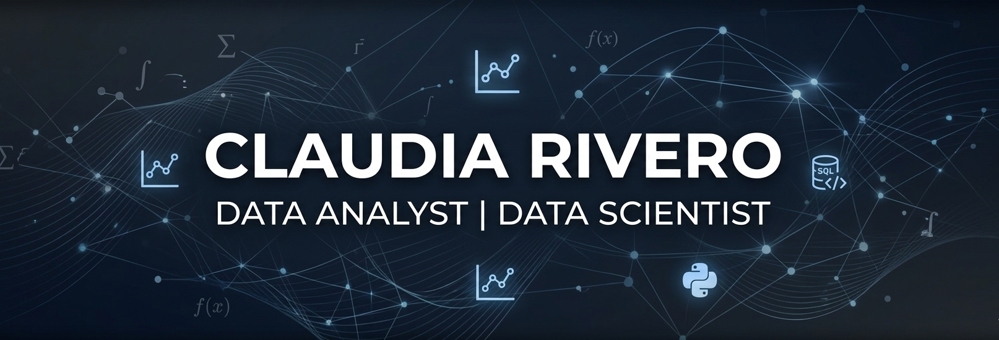

---
### 🌟 Sobre mí

**Analista de Datos | Data Scientist | Machine Learning Specialist**

Soy una profesional enfocada en la transformación estratégica de procesos mediante el análisis profundo de datos y el aprendizaje automático. Mi enfoque se centra en el **análisis de datos avanzado**, combinando una mirada analítica y detallista para resolver problemas complejos.

Me especializo en:
* 🤖 **Modelado Predictivo:** Creación de modelos de Machine Learning para anticipar tendencias.
* 🔍 **Análisis Exploratorio (EDA):** Descubrimiento de insights valiosos en grandes volúmenes de datos.
* 📊 **Visualización Estratégica:** Desarrollo de dashboards e informes que facilitan la toma de decisiones basada en evidencia.

### 🚀 Proyectos Destacados

* **[StockPro Perú](https://github.com/No-Country-simulation/S02-26-Equipo-41-Data-Science)** *Plataforma B2B SaaS para la gestión inteligente de inventarios.*
  * **Mi Rol:** Diseñadora de CX/UX en el equipo **Datamark** (NoCountry).
  * **Logro:** Diseñé interfaces y dashboards analíticos que permiten a pequeños comercios pasar de registros manuales a una gestión profesional con trazabilidad completa de productos y ventas.

* **[Coffee Quality Intelligence](https://github.com/DataScienceHenryBootCampPF/DataScienceHenryBootCampPF)** *Análisis sensorial y segmentación de café de especialidad.*
  * **Técnica:** Implementé K-Means Clustering para segmentar calidades y desarrollé un dashboard interactivo para la visualización de atributos físicos y sensoriales.

* **[FinanceGuard](https://github.com/ClaudiaRivero863/MLops-dtpt01)** *Predicción de fuga de clientes (Churn) en el sector bancario.*
  * **Técnica:** Modelado predictivo utilizando Random Forest y XGBoost, optimizando la retención de clientes mediante análisis de datos históricos.

### 🛠️ Toolbox Técnica

| Área | Tecnologías |
| :--- | :--- |
| **Data Science** | Python (Pandas, NumPy, Scikit-learn), SQL, Machine Learning. |
| **Visualización** | Power BI, Seaborn, Matplotlib, Dashboards Analíticos. |
| **Diseño y Frontend** | UX/UI Design, Prototipado, Vue.js, Tailwind CSS. |
| **Entorno y Datos** | Git/GitHub, Docker, Snowflake Schema, Supabase. |

### 🌍 Idiomas
* **Español:** Nativo.
* **Italiano:** B2.
* **Inglés:** B1.

---

### 📫 Conectemos
Me apasiona aplicar la ciencia de datos en sectores como **Finanzas Corporativas** y **Trading**. Si buscas una colaboradora detallista y con visión de producto, ¡hablemos!

---
*"Nuestro meta es que cada negocio, sin importar su tamaño, tenga el poder de los datos a su favor."* 
